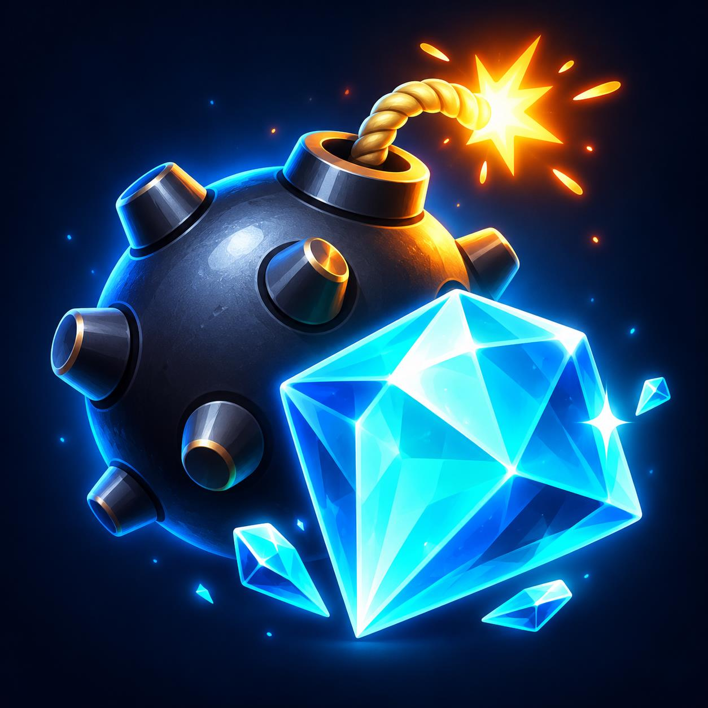

<!--
/**
 * @fileoverview Описание отдельного игрового бота и порядок разработки на Telegram Serverless.
 */
-->
# Мины 💣

[Играть в @KotikMinesGameBot](https://t.me/KotikMinesGameBot).



Логотип с миной и голубым кристаллом создан встроенным imagegen. Исходник и промпт сохранены в assets/.

Сапёр в личном чате Telegram: поле 5×5, уровни с 5, 8 или 12 минами, безопасное первое открытие, флажки и автоматическое открытие пустых областей. Для победы нужно открыть все клетки без мин. Нажатие на мину завершает партию. Игра без ставок и платежей.

Поле обновляется в одном сообщении. При новой партии предыдущее поле удаляется, если Telegram разрешает удаление. Состояние и статистика хранятся в отдельной базе Telegram Serverless. Незавершённые партии не учитываются в статистике. Старые кнопки не изменяют новую партию, одновременные ходы защищены проверкой версии записи.

## Команды

- `/start` и `/help` — выбор режима игры.
- `/game` — выбор сложности сапёра с флажками.
- `/plain` — выбор сложности сапёра без флажков.
- `/risk` — выбор сложности режима «Забрать».
- `/stats` — личные победы и поражения.

Кнопка «Ставить флажки» переключает режим: нажатие ставит или снимает флаг. В режиме открытия клетка с флажком не открывается. Цифра в клетке показывает число мин среди восьми соседей.

Выбор новой партии проходит в два шага: сначала режим, затем сложность. На экране сложности показываются краткие правила и кнопка возврата. На поле остаются игровые действия, «Ещё раз» с теми же настройками и «Выбор игры». В варианте «без флажков» каждое нажатие открывает клетку, кнопки переключения режима нет. Безопасный первый ход, открытие пустых областей и условия победы одинаковы в обоих вариантах. Ранее начатые партии сохраняют флажки.

## Режим «Забрать»

Кнопка «Играть с „Забрать“» открывает выбор 5, 8 или 12 мин. Одно нажатие открывает одну клетку без автоматического открытия соседей и без числовых подсказок. Безопасная клетка приносит 10 очков раунда. Первое открытие безопасно. После первого хода кнопка «Забрать» сохраняет очки и завершает раунд. Мина обнуляет только текущий раунд; ранее сохранённые очки остаются. При открытии всех безопасных клеток очки сохраняются автоматически. Очки игровые, без денег и ставок.

Общая сумма очков и число досрочно завершённых раундов доступны через `/stats`. Проверка версии записи защищает от двойного забора и одновременного открытия клетки.

## Разработка

Нужен Node.js 18 или новее. В @BotFather включите Serverless для этого бота и получите отдельный токен CLI Access. Не используйте токен другого бота.

```powershell
npm ci
npx tgcloud login
npm test
npm run deploy
npx tgcloud migrate --safe
npm run test:cloud
```

Облачные проверки используют временного игрока с отрицательным идентификатором, заменяют отправку сообщений тестовым API и удаляют данные после проверки. Проверяются сохранение партий, конфликт одновременных ходов, старые кнопки и однократный учёт результатов.

Токены не добавляются в исходники. CLI принимает `TGCLOUD_TOKEN` в окружении; `.tgcloud/`, `.env` и `node_modules/` исключены из Git.

Все новые комментарии и JSDoc пишутся на русском языке. Игровые модули находятся в `tgcloud/lib/`, обработчики Telegram — в `tgcloud/handlers/`, схема базы — в `tgcloud/schema.js`.
